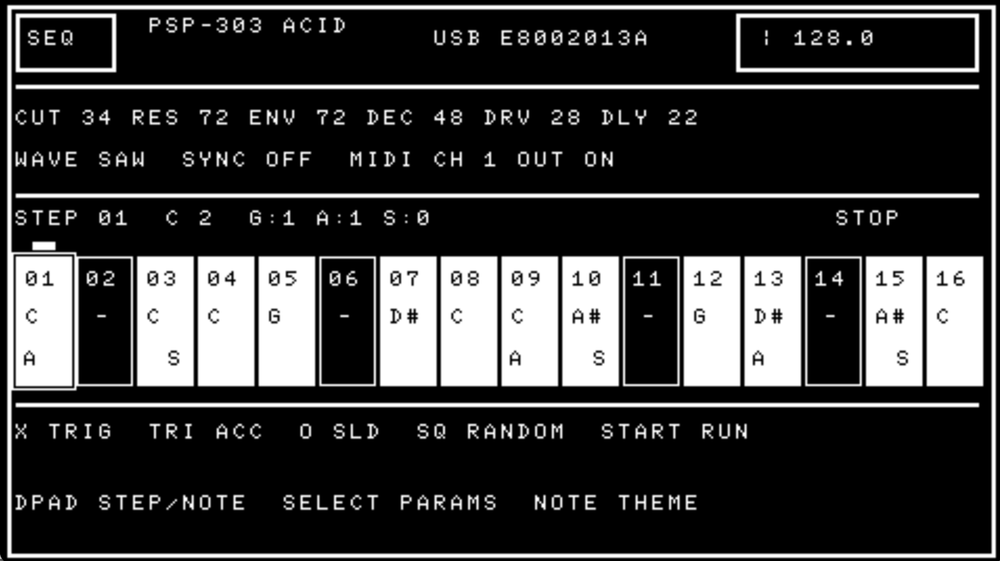

# PSP-303

A minimal monophonic acid synth for Sony PSP, built with PSPSDK. It includes a
16-step sequencer, saw/square oscillator, resonant low-pass filter, cutoff
envelope, decay, overdrive, tempo-synced delay, accents, slides, tempo control,
randomization, Volca/Pocket Operator Sync and USB MIDI notes and clock.



## Installation
1. Get the latest Release
2. Connect PSP
3. Copy folder to /PSP/GAME/


## Build

```sh
mkdir -p build
cd build
psp-cmake ..
make
```

The build produces two files that must stay together:

```text
ms0:/PSP/GAME/PSP303/EBOOT.PBP
ms0:/PSP/GAME/PSP303/UsbMidiDriver.prx
```

## USB MIDI output

PSP-303 automatically presents itself as a class-compliant USB MIDI device.
The built-in synth continues playing while the sequencer also sends:

- MIDI Start and Stop
- MIDI Clock at 24 PPQN
- Note messages for all enabled steps on the selected MIDI channel
- Velocity 120 for accented steps and 100 otherwise
- Four-clock normal gates and legato six-clock slide gates

`MIDI OUT` controls note transmission only. Turning it off leaves MIDI
Start/Stop/Clock and the separate PO/Volca audio-pulse sync running.

The header shows `USB WAIT` before the host opens the connection, `USB LINK`
when connected but stopped, and `USB CLOCK` while transmitting. `USB ERR`
followed by a hexadecimal PSP result means the driver could not be initialized;
the internal synth remains usable. First verify that `UsbMidiDriver.prx` is in
the same directory as `EBOOT.PBP`, then use the displayed result to distinguish
a missing file from a module-load or USB-start failure.

For the cleanest phase alignment, connect USB before pressing Start. If a host
connects after playback has begun, stop and restart the sequencer once.

## Controls

`SELECT` switches between the `SEQ` sequencer page and `PAR` parameter page.

Sequencer mode:

- Left / Right: select a sequencer step
- Up / Down: change the selected step's pitch
- Cross: toggle the step
- Triangle: toggle accent
- Circle: toggle slide into the following note
- Square: generate a random C-minor pattern

Parameter mode:

- D-pad: move the blinking focus between BPM, cutoff, resonance, envelope,
  decay, waveform, drive, delay, sync, MIDI channel, and MIDI output
- Cross: select the focused parameter for editing; press again when done
- Up / Down while editing: change the selected value
- L + Up / Down: change continuous values by 10 instead of 1

D-pad controls repeat automatically after a short delay when held.

Global controls:

- Select: switch between sequencer and parameter modes
- Start: play / stop
- Music-note button: invert the interface between dark and light mode

The sync parameter has three profiles:

- `OFF`: normal mono audio on both output channels
- `PO`: Pocket Operator click on the left, mono audio on the right
- `VOLCA`: 15 ms step pulse on the left, mono audio on the right

Use a stereo breakout cable to route the left channel to hardware sync and the
right channel to a mixer or audio interface.

Enabled steps are filled; `A` marks accent and `S` marks slide.
