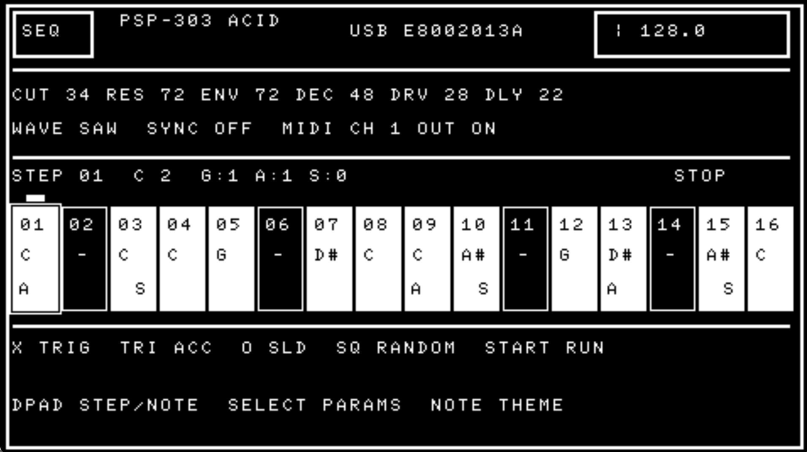

# PSP-303

A compact monophonic acid groovebox for Sony PSP, built with PSPSDK. It keeps the
original 16-step saw/square synth and adds a portable pattern/transport core,
probability, ratchets, per-step gates, swing, directions, scale-aware generation,
mutation, pattern slots, live transpose, analog controller support, versioned
storage, MIDI input/keyboard control, CC mapping/learning, and MIDI clock slave
handling.



## Installation
1. Get the latest Release
2. Connect PSP
3. Copy folder to /PSP/GAME/


## Build

```sh
mkdir -p build
cd build
psp-cmake ..
make
```

The build produces two files that must stay together:

```text
ms0:/PSP/GAME/PSP303/EBOOT.PBP
ms0:/PSP/GAME/PSP303/UsbMidiDriver.prx
```

The repository also contains a host-portable CMake/CTest suite for pattern,
transport, randomizer, storage, and MIDI modules, plus the existing `libpspsync`
test. Run it with `cmake -S . -B build-host-tests -DPSP303_BUILD_HOST_TESTS=ON`.
The PSP job remains separate and checks the EBOOT, bundled driver, and assembled
package files.

Each push and pull request publishes the PSP zip as a workflow artifact. A tag
such as `v1.0.2` publishes it to GitHub Releases; a manual workflow run can do
the same by providing `release_version`.

## Implementation surface and limitations

Pattern slots are stored as versioned, checksum-protected files under
`ms0:/PSP/GAME/PSP303/patterns/pattern00.p303` through `pattern31.p303`.
Malformed, truncated, unknown-version, and checksum-invalid files are rejected
and defaults are retained. Pattern data is encoded field-by-field rather than
by compiler struct layout. The `UsbMidiDriver.prx` remains a runtime dependency
loaded from beside `EBOOT.PBP` (with the documented fallback path).

The implemented controls expose these ranges and switches:

- `BPM`: 60–200 in the UI; cutoff, resonance, envelope modulation, attack, decay, drive,
  and delay: 0–100.
- `WAVE`: saw or square. `SYNC`: `OFF`, `PO`, or `VOLCA`.
- `MIDI CH`: channels 1–16. `MIDI OUT`: note transmission on/off.
- Each step has pitch, enabled, accent, slide, probability, ratchet count, and
  gate length. The portable model supports lengths 3–16 and forward, reverse,
  ping-pong, and random directions. Square generates a scale-aware pattern;
  `L + Square` mutates the current pattern. `R + Up/Down` changes the live key,
  `R + Left/Right` changes scale mode, and `L + R + Left/Right` selects one of
  32 slots; `L + Triangle` saves and `L + Circle` loads the selected slot.
- `L + Select` enters the LFO control mode while retaining the original screen.
  It contains LFO rate, depth, mode, enable, and destination controls. `SMOOTH`
  is free-running while `NOTE` tempo-syncs the rate and quantizes modulation.
- Song arrangements are stored in `ms0:/PSP/GAME/PSP303/song.p3sg`. Each entry
  selects a pattern slot and repeat count; loop start/end and loop enable are
  persisted with the song.

The internal clock is sample-driven at 44.1 kHz and uses four ticks per quarter
note, so one clock tick advances one 16th-note step. The application's playback
restart uses reset-start, which produces an immediate first tick and restarts
step phase; stopping clears pending/pulse output. The underlying clock API also
supports a non-reset start that preserves phase. `PO` emits a 15 ms pulse every
second 16th-note tick; `VOLCA` emits a 15 ms pulse on every 16th-note tick. With
sync off, both output channels carry synth audio; with sync enabled, the left
channel carries the pulse and the right channel carries synth audio.

USB MIDI clock is scheduled independently at 24 PPQN. Start/Stop and clock are
sent when the MIDI link is available. Enabled steps send note-on/note-off data;
accents use velocity 120 and other notes velocity 100. Slides use a six-clock
note length; other enabled steps use four clocks. `MIDI OUT` disables notes only;
it does not disable MIDI Start/Stop/Clock or the separate audio-pulse sync.
Incoming USB MIDI is polled outside the audio callback. Note On/Off drives the
internal monophonic synth with last-note priority, CC mappings use the portable
learnable map, and MIDI Clock/Start/Stop/Continue can slave the transport. Song
Position Pointer is parsed by the portable MIDI layer. The current PSP UI still
does not expose every model field (for example scale selection or individual
delay subdivision labels); those APIs are host-tested and safe to extend.

CI does not exercise a physical PSP, USB host, Volca, or Pocket Operator. USB
enumeration, driver loading on hardware, analog pulse levels, cable routing, and
long-run external-device phase therefore still require device testing. If the
USB driver cannot initialize, the UI reports the PSP result and the internal
synth remains usable.

## USB MIDI output

PSP-303 automatically presents itself as a class-compliant USB MIDI device.
The built-in synth continues playing while the sequencer also sends:

- MIDI Start and Stop
- MIDI Clock at 24 PPQN
- Note messages for all enabled steps on the selected MIDI channel
- Velocity 120 for accented steps and 100 otherwise
- Four-clock normal gates and legato six-clock slide gates

`MIDI OUT` controls note transmission only. Turning it off leaves MIDI
Start/Stop/Clock and the separate PO/Volca audio-pulse sync running.

The header shows `USB WAIT` before the host opens the connection, `USB LINK`
when connected but stopped, and `USB CLOCK` while transmitting. `USB ERR`
followed by a hexadecimal PSP result means the driver could not be initialized;
the internal synth remains usable. First verify that `UsbMidiDriver.prx` is in
the same directory as `EBOOT.PBP`, then use the displayed result to distinguish
a missing file from a module-load or USB-start failure.

For the cleanest phase alignment, connect USB before pressing Start. If a host
connects after playback has begun, stop and restart the sequencer once.

## Controls

`SELECT` cycles through the visible `SEQ`, `PAR`, `PREF`, and `SONG` pages. The active
page is shown in the header badge and in the `PAGE [...]` breadcrumb at the
bottom of the screen. `R + SELECT` jumps directly to the song page and
`L + SELECT` jumps directly to the LFO preferences page.

Sequencer mode:

- Left / Right: select a sequencer step
- Up / Down: change the selected step's pitch
- Cross: toggle the step
- Triangle: toggle accent
- Circle: toggle slide into the following note
- Square: generate a pattern in the displayed key and scale mode
- `R + Cross`: cycle ratchets 1–4
- `R + Circle`: cycle gate length 25/50/75/100%
- `R + Triangle`: cycle probability 25/50/75/100%
- `L + Square`: mutate the current pattern
- `R + Up/Down`: change performance key and transpose live playback
- `R + Left/Right`: change performance scale mode
- `L + R + Left/Right`: select pattern slot
- `L + Triangle`: save selected slot
- `L + Circle`: load selected slot

Preferences page:

- Left/Right: browse within the current LFO row; Up/Down: move between rows
- `Cross`: lock/unlock the focused LFO tile for editing
- Up/Down while locked: edit rate/depth, cycle destinations, or toggle mode/enable
- Analog nub X/Y while locked: coarse-adjust the focused rate, depth, or destination
- Destinations: cutoff, resonance, envelope, decay, drive, delay mix, and tune
- `MODE NOTE` tempo-syncs Rate to the current BPM and displays divisions from
  `4/1` through `1/32`; `MODE SMOOTH` displays the free-running rate in mHz
- `Triangle`: arm MIDI learn for the next incoming CC

Parameter mode:

- D-pad: move the blinking focus between BPM, cutoff, resonance, envelope,
  decay, waveform, drive, delay, sync, MIDI channel, and MIDI output
- Cross: select the focused parameter for editing; press again when done
- Up / Down while editing: change the selected value
- L + Up / Down: change continuous values by 10 instead of 1
- Attack controls the VCA rise time; low values retain the immediate acid bite,
  while higher values soften the note onset.

Song controls (`R + SELECT`):

- D-pad (browse): Left / Right selects Pattern or Repeats on an entry; Up / Down selects entries. From the last entry, Down opens the Loop, Start, and End bar.
- Cross: lock or unlock the focused field for editing
- D-pad Up / Down or analog nub (locked): adjust the focused pattern, repeats, loop range, or loop switch. Turning Loop on starts with the full song range; Start and End can then define a smaller loop region.
- Circle: delete the selected entry
- Square: add a new entry after the selected entry
- Triangle: save the song
- L + Triangle: load the song
- `L + START`: toggle song playback mode

When song playback mode is enabled, entries play in order for their repeat counts.
Loop-enabled songs jump from loop end back to loop start; non-looping songs stop
after the final entry. Enabling song mode during playback restarts from entry 1;
if an entry's pattern cannot be loaded, playback stops safely instead of
continuing the previous pattern.

D-pad controls repeat automatically after a short delay when held.

Global controls:

- Select: cycle sequencer, parameter, preference, and song screens
- R + Select: enter song controls
- L + Select: enter LFO controls
- R + Start: open the song page and start/stop song playback
- Start: play / stop
- L + Start: toggle song playback mode
- Music-note button: invert the interface between dark and light mode

The sync parameter has three profiles:

- `OFF`: normal mono audio on both output channels
- `PO`: Pocket Operator click on the left, mono audio on the right
- `VOLCA`: 15 ms step pulse on the left, mono audio on the right

Use a stereo breakout cable to route the left channel to hardware sync and the
right channel to a mixer or audio interface.

Enabled steps are filled; `A` marks accent and `S` marks slide.

## License status

This repository does not currently declare a root-project license in its source
or documentation, so no license has been inferred or added. The bundled
`psp-usb-midi` notices and source remain unchanged. A project owner should add
the intended root license before redistribution.
